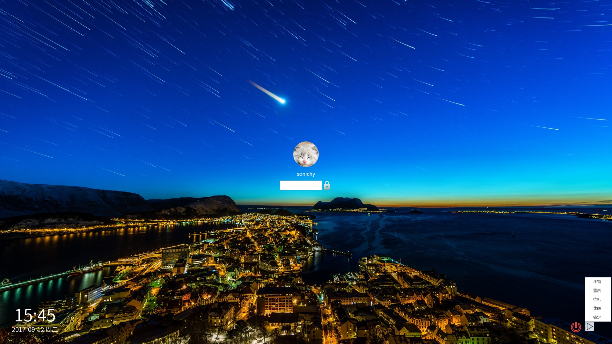

# Qt: 海天鹰锁屏
Linux 平台基于 Qt 的锁屏界面。
    
模拟深度Linux系统登录界面，主要是不喜欢其背景模糊，可以获取用户头像、用户名、系统壁纸和关机，无锁定系统功能，密码：1111登录（关闭），或者Alt+F4关闭。  
设置快捷键启动更方便哦！
### 更新历史
V1.1 (2017-08-29)  
1. 使用圆形头像。  

V1.0 (2017-07)  
1.界面、关机功能和登录模拟。